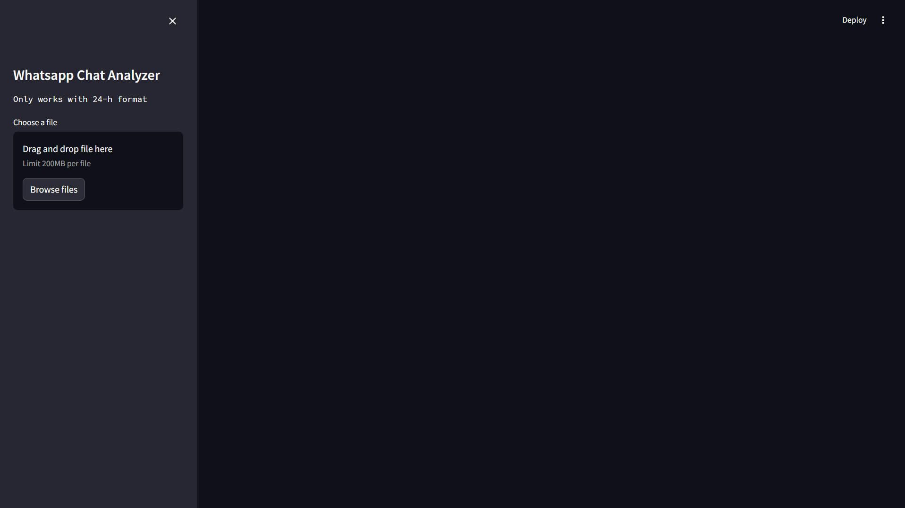

<h1> Whatsapp Analyzer project</h1>

<h2> Details of the project </h2>
This is a python based project that takes in exported whatsapp chats and provides analysis of the chat.

It is made with Streamlit and deployed on Docker

Currently, it only supports exported chats which are in **24h time format**

<h2>Running the project</h2>
To run this directly from Docker run the following code in your terminal

`start docker`

`docker pull anuraggc15/whatsapp_analyzer:v0`

`docker run -p 80:80 anuraggc15/whatsapp_analyzer:v0`

On running it you will get a code to run this app in your local machine and it will look something like this

After uploading an exported chat and clicking on **Show Analysis** , you can observe and analyze the chats.

<h2>Further developments to be made</h2>
>1. Better graphs with time series analysis
>2. Addition of 12h time format support
>3. Better stopword support
>4. Sentiment analysis
